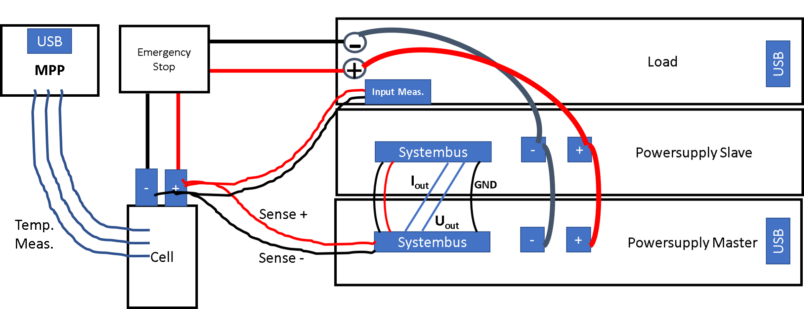
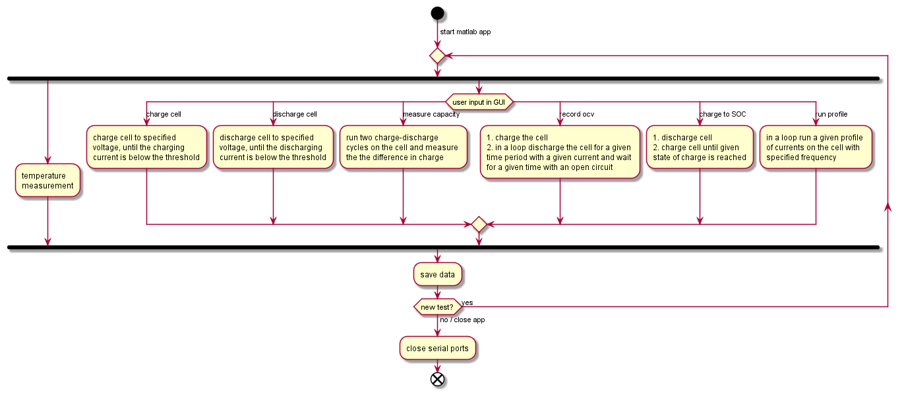
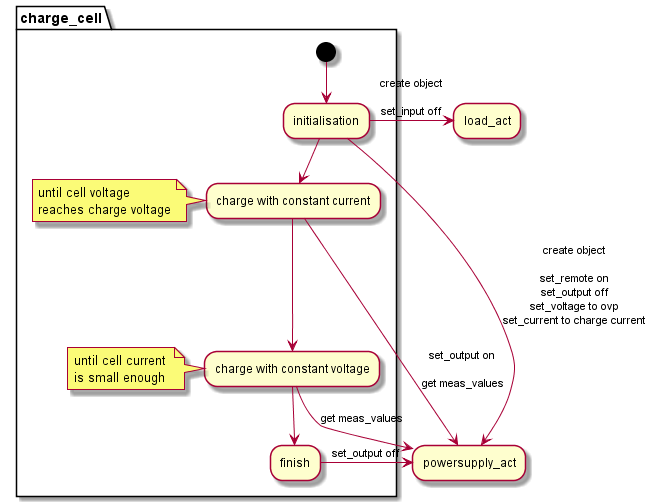

# DHBW Engineering Cell Testbench 2020/2021
### Electrical Setup

### Mechanical Setup
### Measurement PC Setup
app_testbench21 at _C:\\users\\public\\celltestbench\\_

periphery at ports: 

COM3 MPP

COM4 powersupply

COM5 load

Note: the testbench is programmed to work with 2 powersupplies connected in parallel. Otherwise the powersupply actuator needs to be adjusted.
### Software Setup

